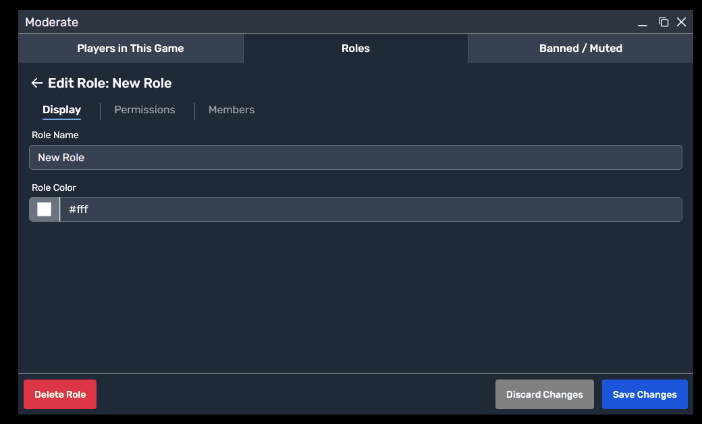
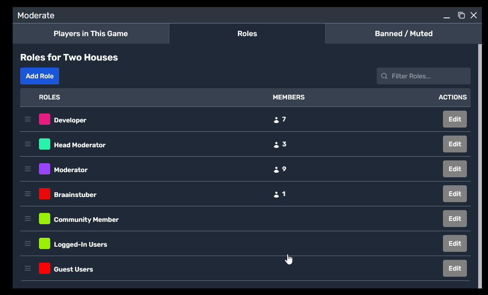

# Roles

One of the ways you can manage and foster your game's community is by maintaining clear roles. This Article will teach you how to create and customize permissions based on roles in order to maintain a healthy and thriving environment for your players.

## What are Roles?
Roles allow creators to set specific permissions and privileges in their game. Permissions range from basic features like allowing players to chat in the game's server chat to advanced permissions like editing the game map. You can create and edit Roles in the Moderation window and assign members and permissions to individual roles.

Roles also have a visual impact: the color of the player's nametag in chats is displayed with the color of the highest role they are a member of.

## Setting Up Roles

### Automatic Roles
Moddio Roles feature a handful of built-in roles. These roles help automatically group players based on whether they are registered or a part of the game community and can be customized to your liking.

#### Guest User
The guest user role is automatically assigned to all users that are playing on the Moddio platform without a registered account. Guest users are not allowed to chat in any game server / community chat. 
For security reasons they can also not be assigned any additional permissions.

#### Logged-In User
If not assigned any other role, this is the default role for all users that are playing with a Moddio account. 
By default, logged-in users are able to participate in a game's server chat and send direct messages.

#### Community Member
Any registered user can choose to join your game community. After they have joined the community for your game, permissions from this role will be applied.
By default, the additional permission users gain by joining your game community is access to the community chat.

### Customizable Roles
The Role management feature allows the creation of entirely custom roles. To simplify the most commonly assigned sets of permissions, Moddio includes 3 default roles. Feel free to adjust these to your liking or use them as a base for your own, entirely unique game role.

#### Moderator
Moderation is an important part of maintaining a healthy game community. Moderators can help make sure that players stay civil and keep bad actors from ruining other people's fun.
By default, a moderator is able to:
- Ban Players
- Kick Players
- Mute Players

#### Contributor
If you are interested in collaborating with another creator to create a game, this is the right role! By assigning a player to be a member of this role, they will gain the following additional permissions:
* Map Editing
* Entity Editing
* UI Editing
* (Re-)Publishing
* Announcements

## Creating And Assigning A Custom Role:

### Step 1: Create Role
Your journey to setting up custom permissions in your game begins with you creating a new role!

When you first create your game there are only the built-in roles. These should cover most cases of permissions needed, but in the case that you want to create a more granular set of permissions, you will need to create your own role.

>As the owner of your game you will always have access to editing any aspect of your game. Some administrative actions like deleting your game can not be assigned to anyone but the game owner for security reasons.

1. Press on the hammer icon next to the hamburger menu in the top left of your game. This will open the Moderation window.
2. Select the Roles tab, then press 'Add Role'.

### Step 2: Customize Role And Permissions

1. Give your new role a name and a color. The role color determines what color the username of members will be displayed as in the game chat.
2. Select the **Permissions** tab of the newly created role to see the list of available permissions you can assign to this role.
3. Consider what you want the members of this role to be able to do when assigning permissions.
4. **Save** the changes you've made to this role!

### Step 3: Assign Members To Role
You can press on the **Members** tab of your role to assign members manually by entering their name. 

