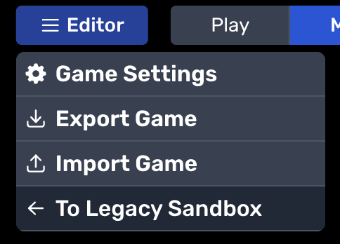

# Interface

The main Moddio interface remains the same no matter which template you choose. To start a new game, go to **Create** after opening Moddio. Then, click the **Create a new game** button and select your template. This will take you into the game and open the game editor.

By default, when you enter Moddio, you'll be in Play mode. However, as the owner of the game, you'll have additional UI options that regular players don't have. At the top of the game screen, there's a navigation bar in the center of your window. The bar includes buttons for Editor, Play, Map, Entities, Moderate, Report, and the Publish/Republish button.

Later on, we'll explore each button in more detail. But for now, let's focus on the main workspaces available:

## Editor

In the drop-down menu, you can find options to Export and Import JSON and access Settings. You can also access the legacy sandbox by selecting this drop-down menu.

## Map

In this workspace, you can use map editing tools. The Map Editor provides tools like Cursor, Entities, Stamp Brush, Eraser, Bucket, and Region, along with a layer selection. Below that, there's a Palette sourced from the game's Settings. It displays all the available tiles from the selected tilesheet for building the map.

    
### Tools and Size Buttons

Here's a breakdown of each tool in the Map Editor:

* The **Cursor Tool** allows you to interact with regions or entities on the map with a **Left Click**.
* The **Entities Tool** lets you interact with entities on the map. When selected, a list of your entities will appear. You can choose an entity from the list and place it on the map by clicking. Switching back to the **Cursor Tool** allows you to resize the entity by dragging its corners.
* The **Stamp Brush** works like a brush, placing your selected tile on the map with a **Left Click**. You can adjust the size of the brush using Alt + Wheel scroll.
* The **Eraser** tool removes the selected tile. It's handy for deleting tiles.
* The **Region Tool** allows you to create regions. These regions can be used in Scripts to trigger actions or events within specific areas.
* The **Layer Toggle** is located under the tools. Layers are ordered from top to bottom, so Trees are always above Walls and the Floor layers. You can switch layers by clicking on the desired layer. Any changes made using the tools will occur on the selected layer.
* The **Tile Picker**, found in the bottom corner, can be toggled on or off by clicking on the **palette** or pressing the **tab** key. When open, you can select tiles from the palette and place them on the map.
  * **Right-clicking** on the map will copy the tiles currently under your cursor, including any empty tiles.

## Entities

In the game, there are different things called World, Units, Items, and Projectiles. You can change their properties, scripts, and cellsheets using this interface. You can also add more things to the game and give each one special instructions. This is where you do most of the work to create and build your game.

## Report

The window is divided into different tabs: Overview, Server Logs, Server Crash, Coin Report, and Cohort analysis. These tabs show you information about how well your game is doing and its statistics. You can also see how many coins you've earned from playing the game.

